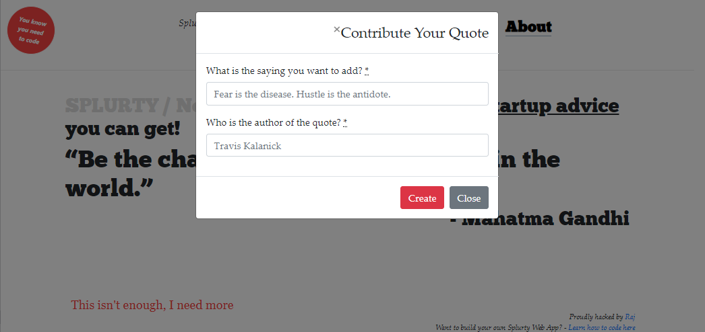

# Splurty

An app that allows for quotes to be entered by visitors. The quotes get saved to a database, and then appear at random on the homepage for others to read.

## Visit us! Click [here](https://splurty-rajkumar-mukerjee.herokuapp.com/).

## Tools & Resources

* [Ruby on Rails](https://rubyonrails.org/) 
* [PostgreSQL](https://www.postgresql.org/)
* [Bootstrap](https://getbootstrap.com/)
* [Google Fonts](https://fonts.google.com/)
* [Heroku](https://www.heroku.com/)

Enjoy your day!